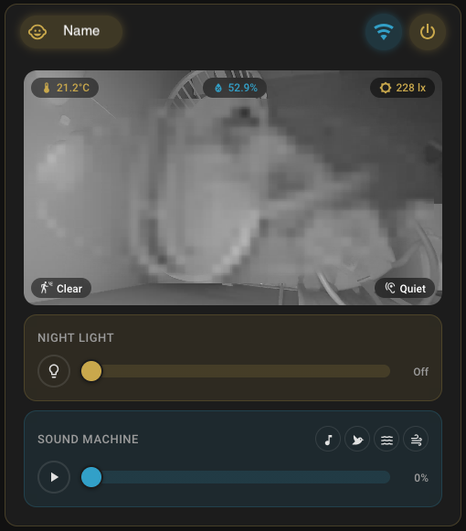

# Nanit — Home Assistant Integration

<p align="center">
  
</p>

<a href="https://github.com/wealthystudent/ha-nanit">
  
</a>

---

> **Monitor your baby — right from Home Assistant.**
>
> Live streams, nursery sensors, night light control, and automations — all from your HA dashboard. Works with all Nanit cameras and the Sound & Light Machine.

<p align="center">
  
</p>

## Requirements

- Home Assistant **2025.12** or newer
- A Nanit account with email/password
- [HACS](https://hacs.xyz/) (recommended)

## Installation

### HACS (recommended)

1. Open **HACS → Integrations → ⋮ → Custom repositories**.
2. Add `https://github.com/wealthystudent/ha-nanit` as **Integration**.
3. Install **Nanit**, then restart Home Assistant.

### Manual

Copy `custom_components/nanit/` into your HA `config/custom_components/` directory and restart.

## Setup

1. Go to **Settings → Devices & Services → Add Integration → Nanit**.
2. Enter your Nanit email and password.
3. Enter the MFA code sent to your device (use the latest code — they expire quickly).
4. Done — all devices on your account (cameras and Sound & Light Machines) are discovered automatically.

## What you get

**Per camera:**
- 📷 Live camera stream (RTMPS)
- 🌡️ Temperature & humidity sensors
- 👁️ Motion & sound detection
- 💡 Night light switch
- 🔌 Camera power switch

**Sound & Light Machine** (works standalone or paired with a camera):
- Power, sound, and light switches
- Sound track selector, volume & brightness controls
- Temperature & humidity sensors
- Battery level & charging status
- Firmware version (diagnostic)
- WiFi signal strength (diagnostic, disabled by default)

Some entities are disabled by default. Enable them in **Settings → Devices & Services → Nanit → Entities**.

> Coming from [nanit-sound-light](https://github.com/com6056/nanit-sound-light)? That integration has merged into this one. Its [migration guide](https://github.com/com6056/nanit-sound-light/blob/main/MIGRATION.md) maps every entity id.

## Dashboard Card

A companion Lovelace card is **bundled with the integration** — no HACS frontend dependencies or manual JS installation required. After setup, the card appears in your card picker automatically.

**To add it:** Open any dashboard → **Add Card** → search for **Nanit** → select your camera.

The card provides:
- Live camera stream with loading indicator
- Temperature & humidity overlays, with optional semantic entity overrides for the displayed sensors
- Motion & sound activity indicators
- Optional baby name and connectivity status display
- Header power button (can be hidden in card settings)
- Night light slider (drag to adjust brightness, 0% = off; can be hidden in card settings)
- Sound machine controls with icon-based track selection (can be hidden in card settings)
- Volume slider
- Network info popup (WiFi name, frequency, signal strength)

Optional sensor overrides can be set in the visual editor or YAML when you want the overlay to display another Home Assistant sensor instead of the Nanit-discovered sensor:

```yaml
type: custom:nanit-card
camera_entity_id: camera.nursery
temperature_entity_id: sensor.nursery_temperature
humidity_entity_id: sensor.nursery_humidity
```

> [!NOTE]
> If your Lovelace is in **YAML mode**, add the resource manually:
> ```yaml
> resources:
>   - url: /nanit-card/nanit-card.js
>     type: module
> ```

## Actions

The integration provides one action:

**`nanit.reset_stream`** targets a Nanit camera entity and discards Home Assistant's cached camera stream, so the next viewer gets a freshly negotiated stream from the Nanit cloud. The bundled dashboard card calls it from its recovery button, and it is useful in automations or scripts when a stream shows a stale or frozen picture. It has no parameters beyond the target.

```yaml
action: nanit.reset_stream
target:
  entity_id: camera.nursery
```

## Data updates

How each piece of data reaches Home Assistant:

- **Camera sensors** (temperature, humidity, night light, connectivity) arrive as push updates over the camera's WebSocket, so they update in real time.
- **Motion and sound events** come from the Nanit cloud API, polled every 30 seconds.
- **Network diagnostics** (WiFi details) are polled every 5 minutes.
- **Sound & Light state** (power, sound, light, volume) arrives as push updates over the speaker's WebSocket, local or relay. A light 30 second poll reconciles state and refreshes battery and WiFi diagnostics. The firmware version is fetched once per start.
- **Video** streams on demand over RTMPS when a viewer opens the camera.

## Local connection (optional)

For faster response times, you can connect directly to your camera over LAN:

**Settings → Devices & Services → Nanit → Configure** → select device → enter its local IP address.

The integration will use your local network for sensors and controls, falling back to cloud for auth and events.

The Sound & Light Machine needs no configuration for this: it is discovered on the LAN automatically (mDNS) and the local connection is preferred whenever the speaker is reachable, with the cloud relay as fallback. A manually configured speaker IP takes precedence over discovery.

One thing worth knowing: the speaker accepts a single local client at a time. If the Nanit phone app on the same network holds the local slot, the integration uses the cloud relay and takes the local slot back automatically when it frees up.

## Troubleshooting

| Problem | Solution |
|---------|----------|
| MFA code rejected | Codes expire fast — use the latest one. |
| Stream not playing | Verify HA can reach `rtmps://media-secured.nanit.com` and the Stream integration is enabled. |
| Stream frozen or stale | Run the `nanit.reset_stream` action on the camera entity (the dashboard card's recovery button does the same). |
| Sensors unavailable | WebSocket reconnects automatically. Try reloading the integration if it persists. |
| Local connection failing | Confirm the camera IP is correct and port 442 is reachable from HA. |
| Re-authentication required | Session expired — click the notification to re-enter credentials. |
| Other issues | Check **Settings → System → Logs** (filter for `nanit`) or download diagnostics from the integration page. |

## Known limitations

- Authentication, motion/sound events, and streaming always require the Nanit cloud — no fully offline mode.
- Motion and sound detection is polled every 30 seconds (up to ~30s delay).
- Live video requires your HA instance to reach `rtmps://media-secured.nanit.com`.

## Removing the integration

1. Go to **Settings → Devices & Services → Nanit**, open the three dot menu on the entry, and choose **Delete**. This removes all Nanit devices and entities and deletes the stored account tokens.
2. If you installed through HACS, also remove the repository there: **HACS → Nanit → three dot menu → Remove**, then restart Home Assistant.

The integration keeps no other state on disk. If you use the bundled dashboard card in YAML mode, remove its resource entry as well.

## Contributing

See [CONTRIBUTING.md](CONTRIBUTING.md) for setup and PR workflow.

## License

[MIT](LICENSE)
